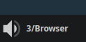

A workspace switching applet for cinnamon.



Displays the current workspace index and name.

	See cornerbar@cinnamon.org.

Use your scroll wheel to cycle.

Modifiers + Click can be configured to have different behaviors.

# Installation

```shell
cd ~/.local/share/cinnamon
git clone https://github.com/Squirreljetpack/corner-workspace-squirreljetpack
# Right click cinnamon bar -> Applets -> Corner bar + workspace indicator -> Add (+)
```

